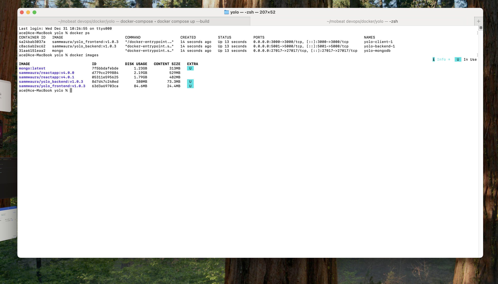
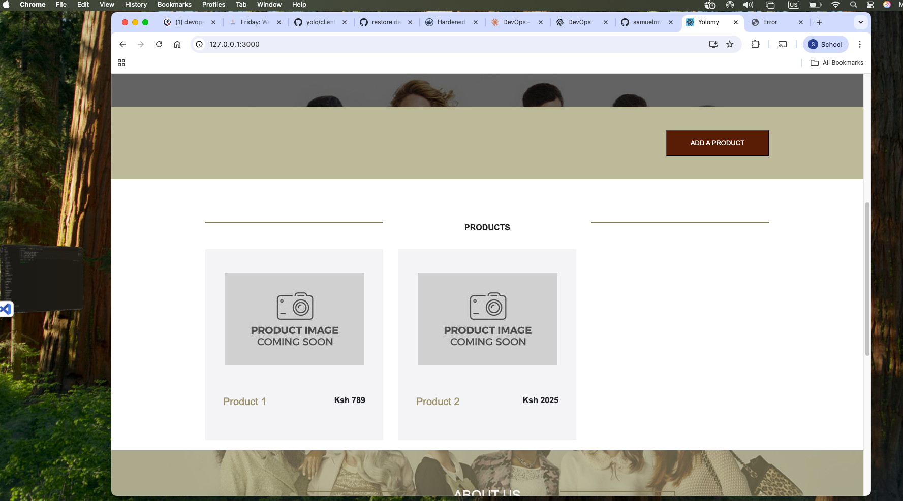
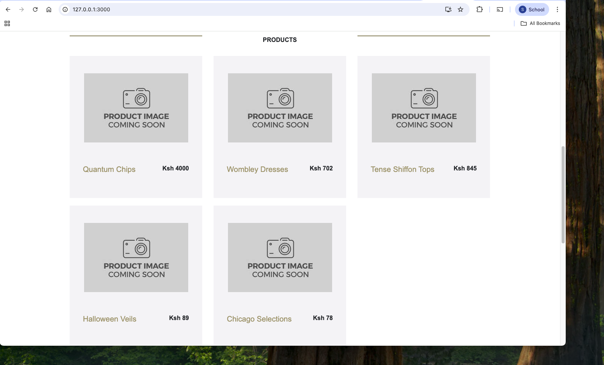
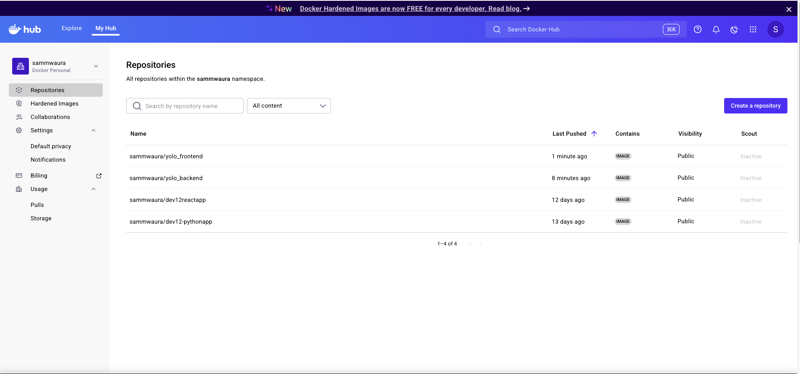

# YOLO PROJECT CONTAINERIZATION IMPLEMENTATION EXPLANATION

1. Choices of the base images to build the containers

##### Client Image - sammwaura/yolo_frontend:v1.0.4
    The client image is built in mutlistage and has 2 stages; **Building** stage and **running** stage. The building stage uses the **node:18-slim** image that contains the already setup environment with the following
        .The node runtime - node.js,npm e.t.c
        .A minimal linux operatiing system that brings in the linux filesystem
        .Libraries to run the application and the dependencies.
    The build stage image takes in the yolo application frontend source code and the dependencies installed using 'npm install' and builds it into build files based on the environment provided by the base image.
    The run stage of the client image uses the image **nginx:alpine** which is an image with the functionality of serving static files. The build files that are gotten from the build stage are copied into a new image with nginx which serves the files at port 80. When doing docker compose, the traffic on the host at port 3000 is directed to port 80 which is the nginx default port in the container.

##### Backend Image - sammwaura/yolo_backend:v1.0.4
    The backend image is also build in a mutlistage way but makes use of one base image which is **node:18-slim**. The base images contains a few thing that make it ideal to add the project backend source code and create an image.The image has: 
         .The node runtime - node.js verison 18, npm and node binaries
         .A minimal linux debian operating system that provides the linux operating system
         .System libraries that run node, npm modules and that open network ports.

 2. Dockerfile directives used in creating and running of each container
    - The Client image is built from the **frontend.dockerfile** and the backend is built from **backend.dockerfile**. Each of the two files has two stages, one for build and the other as a running stage. The running stage becomes the final image from where the container is created and is a small sized image.
    - To run the containers, docker compose creates services from the earlier built images. A port is exposed for each container and the backend and client are added to the **yolo-backend-frontend-network**.
    - The images created and the containers that are run from those images are shown in the screenshot below.

3. Docker-compose Networking (Application port allocation and a bridge network implementation) where necessary.
   - The client service and the backend service are in one network called **yolo-backend-frontend-network**. The client has **port 80** exposed in the network as it is the default port via which nginx serves static files. The commands to start the nginx server and serve the static files are already defined in nginx base image.The host traffic on port 3000 is directed to port 80 in the client container.
   - The backend service exposes port **5000** and has host traffic on port **5001** mapped to its port 5000. The network between the client and the backend is a bridge network that does not have any other container on. 
   - The mongodb database container exposes the default port for mongodb service which is **27017** and is on the same network with the yolo application backend. The calls to the database are done via that network and the application frontend cannot communicate directly to the backend.

4. Docker-compose volume definition and usage (where necessary).
   - A docker volume has been defined by the name **yolo-app-data** for the persistence of the database data. The data  in the mongo db container is stored inside the folder **/data/db**. This folder is then mapped to the docker volume defined in the docker compose and persists the data on products input.

5. Git workflow used to achieve the task.
   - All commits in the development of the project containerization have been done and pushed to the remote repository **git@github.com:samuelmwaura/yolo.git** on branch master. The commit stages summarily represent:
     . Creating a readme for the application on the steps to be followed in solving the IP
     . Changes done by runnning the application locally
     . Creating the docker files in a single stage way.
     . Creating the docker-compose file
     . Changes to the source files in the course of running the application
     . Debugging in the files
     . Transforming the docker files to multistage build files
     . Adding explation.md file for the IP objectives explanation.

6. Successful running of the applications and if not, debugging measures applied.
   - The whole application runs successfully when all the services are started using **docker compose** commands. The following commands facilitate the starting, stopping and rebuilding of the image and the containers
     . docker compose up - Starting up all the containers.
     . docker compose down - Stopping all the sevices
     . docker compose up -d --build - Starting up all the services while rebuilding all the images to include any changes made.

    - When all the services are up, the application is accessed on localhost at port 3000 and present the frontend UI as shown below:

 

    - When any product is added, it is persisted in the mongodb and does not get lost when the services are spinned down.

7. Good practices such as Docker image tag naming standards for ease of identification of images and containers.
   - The client image is tagged correctly as **sammwaura/yolo_frontend:v1.0.4** while the backend image is tagged as **sammwaura/yolo_backend:v1.0.4**. The tags are version v1.0.4 to signify the previous stages when the docker files used to build the images were single stage. The two images have been successfully pushed to dockerhub as shown below:

