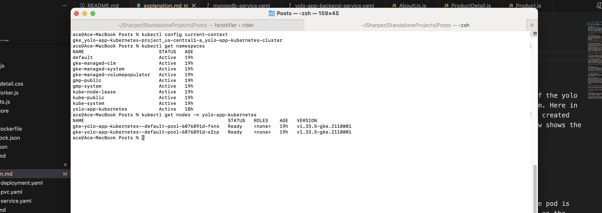

### YOLO PROJECT KUBERNETES IMPLEMENTATION EXPLANATION

##### Cluster and namespace
The cluster and the namespace created in the Google Kubernetes Engine for this project are as listed below
1. Cluster - gke_yolo-app-kubernetes-project_us-central1-a_yolo-app-kubernetes-cluster
2. Namespace - yolo-app-kubernetes
3. Nodes - gke-yolo-app-kubernetes--default-pool-6076891d-f4n4
           gke-yolo-app-kubernetes--default-pool-6076891d-x2cp

The kubectl context is set to this cluster context from the earlier locally pointed minikube cluster. The foloowing screenshot shows the cluster, nodes and the namespace and their current statuses.

##### PersistentClaimVolume
1. mongodb-pvc
This is the claim volume that was used to claim a volume for the mongodb pods that are running the Database of the yolo application. Once the mongodb deployment is run, the pods are connected to a persisten volume using this claim. Here in GKE, we did not create a persistent Volume but instead this was allocated to us automaltically by GKE when we created this claim. The claim remained in pending state until the mongodb-deployment was applied. The screenshot below shows the pvc after being applied, awaiting allocation to a deployment.

  

##### Deployments

1. yolo-app-mongodb deployment
This is the kubernetes object that deploys pods for the mongodb that stores data for the application. Only one pod is generated for the mongodb and it is connected to a persistent volume to make sure data entered about products on the yooly application is persistent. The containers in the pod run from the **mongodb** public image that is fetched from dockerhub.
The connection happens via the claim done using the mongodb-pvc. Below is a screenshot of the mongodb pod.

2. yolo-app-backend deployement
This deployment sets a replica set of 3 pods running for the backend. The service calls the using the service names exposed by kubernetes when the cluster network for themongodb pod uis created. The replica set is exposed to the frontend by a service that has been applied creating a cluster network. The label used to map this backend replica set is **yolo-app-backend.**
The pods here run containers made from the image **gcr.io/yolo-app-kubernetes-project/backend:v1.0.4** that is already uploaded to the Google Artifacts registry. The image is converted into a GKE compatible image by building it into ARM 64 architecture different from the earlier built images that I used for vagrant and ansible.once in the registry, the 2 nodes in the yolo-app-kubernetes namespace download and run the containers. Below images show the Google Artifacts Registry and the BE pods running.

The yolo-backend deployment connects to the mongodb replica set using services exposed for both the BE and mONGODB. The two services are of type ClusterIp since communication between the Backend and the database happens internally within the cluster hence no need to expose the two to the public.

3. yolo-app-frontend deployment
This is the deployment that sets the frontend pods active. The deployment specifies a total of 3 instances of the same frontend pod running and all are labelled **yolo-app-frontend**. The label is used to select them by the FE service that sets the pods accessible to the public since they are the client facing end of the yolo application.
The pods run containers from the image **gcr.io/yolo-app-kubernetes-project/frontend:v2** that is deployed to the Google Artefacts registry. The image below shows the list of pods running for BE, FE and the mongodb.

##### Services
1. yolo-mongodb service
The service exposes the mongodb pods in the namespace to be able to communicate with other pods in the cluster. The type of the service is the defaut one of Cluster Ip since the mongo set is only reachable by the Backend that sends data and pulls data from it. The service selects the pod deployment with the label **yolo-app-mongodb** hence exposing the pod to receive/send traffic within the cluster. Below screenshot shows all the 3 applcation services running.

2. yolo-app-backend-service
The service object exposes the the deployment with the pods that have the label **yolo-app-backend**. The replica set is set to receive and send traffic within the cluster hence communicate with the FE and mongodb. The type of service is there cluster IP.

3.yolo-app-frontend-service
This service of the type **LoadBalancer**. This is to make sure that it makes use of the Google Kubernetes Engine Load Balancer to be able to be accessed to the public through assignment of a public IP. The public IP address assigned in the yolo-app-frontend-service is **35.192.142.245** which is accessible from outside the cluster. The frontend service is the interface with the outside environment hence it needs to be accessible from any client's applications. The request once receuved in the FE by the app, they are channeled to the backend via the backend service and later data pulled/sent to the db via the mongodb service. Below is a screenshot showing the public IP address assigned to the FE service.

Below is a screenshot of the application being accessed from the chrome client browser using the public Ip. The products are input and are persisted in the storage.

#### Conclusion

The above setup of kubernetes objects achieves a full deployment of the yolo-application from the FE module, BE module and the mongodb with a persistent volume on Google Kubernetes Engine. The application can then be accessed from the internet using the assigned IP.

The version control workflow used to achieve the development of the kubernets objects has been well documented with commits after every object creation, debugging done when applying the objects and the screenshots for the progress of developing the cluster and the yolo-app-kubernetes project.