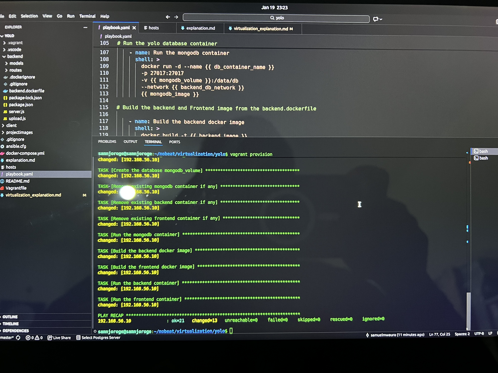
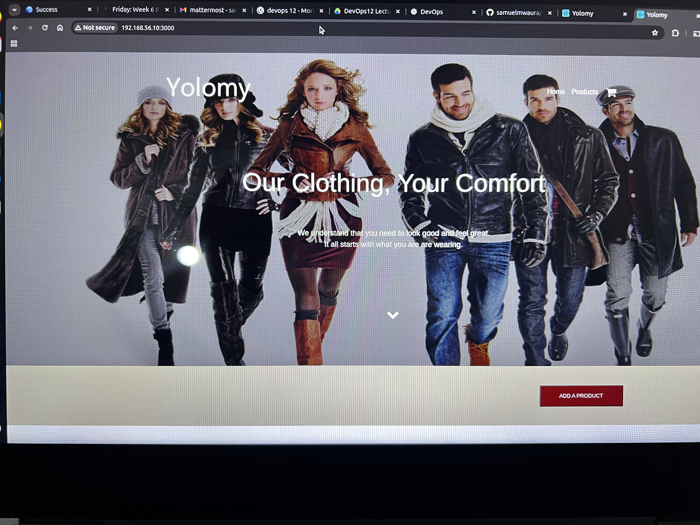
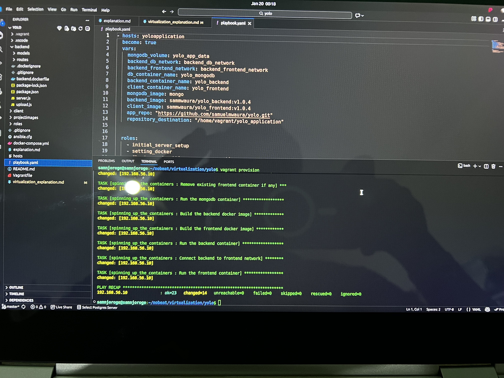

### YOLO PROJECT VIRTUALIZATION IMPLEMENTATION EXPLANATION

1. Choices of tools

##### Vagrant  for Server Provisioning
Vagrant is choosen in collaboration with virtual box inorder to create a server that will hold and serve the resources for the yolo application. The server is provisioned by running **vagrant init** to initialize a vagrant file that specifies the characteristics of the server on which the application is deployed.  
The initial network specification and number or CPUs cores to be engaged and the the memeory are all defined in the Vagrant file. The file specifies **ubuntu/jammy64** as the box image from where the server in our virtual machine runs.

##### Ansible.cfg, hosts, and playbook.yaml for configuration
Once the server has been provisioned, it is configured and made ready using the **playbook.yaml** file that contains a series of tasks that when run;
   - Update the apt package manager in the server
   - Confirm that the server is connected
   - Install docker that will hold and the application containers
   - Create docker networks
   - Create docker volumes
   - Build the images from the dockerfiles.
   - Run all the 3 application containers and network them for communication.
   - Sets the application ready for running.
   - A minimal linux debian operating system that provides the linux operating system
   - System libraries that run node, npm modules and that open network ports.

**Ansible.cfg** is the file where all the defaults that are defined in ansible defaults file have been overriden to provide the contexts pf the yolo Application. Here the vagrant folder path that has the **private key** has been defined , the path to the inventory of the servers to be managed and the user to be used to access the server are as well detailed here.

The **hosts** file contains a detail of the servers to be managed using the playbook that has been detailed in the application. For the case of the Yolo Application, the server is one and will have docker where all the 3 applications containers will run from.

2. Ansible Roles
    - To modularize the process of configuring the provisioned server, the ansible tasks have been broken down into roles that hold a list of related tasks each. Instead of explicit listing, the roles are called by name from the main playbook.yaml file .
    - The yolo application configuration playbook.yaml contains 4 defined roles:
        
        1. Initial set up of the server - Check connection and updating the package manager.
        2. Setting up the docker engine that will hold the application components.
        3. Cloning the application from the repository and defining the network and volume where the data for the application will be persisted
        4. Spinning up all the services in the server - Spinning up the FE, BE and the Mongo Db service.

   When the server is set running, the roles run in the order they are called in the playbook and eventually contribute one complete process of congiuring a server.

   

3. Spinning up the application
   To fully realize the role of vagrant and ansible in infrustructure provisionning and configuration, this application **does not** make use of the docker compose file for orchestration of the Yolo application services. The Playbook.yaml contains variables that are called in roles and which setup everything from scratch to the very last bit of spinning up the functional containers.

   The whole Yolo application has been confirmed as fully virtualized and running successfully in the virtual server when the command **Vagrant provision** is run. This is confirmed by the accessibity of the application when the private IP address is accessed **192.168.56.10: 3000** in the browser. It launches the application as shown below. The products in the ecommerce site can be added and are persisted as well as shown.

    
   
   
    The products are also confirmed to be persisted in the database and accessible via the backend container as shown by the panel below:

